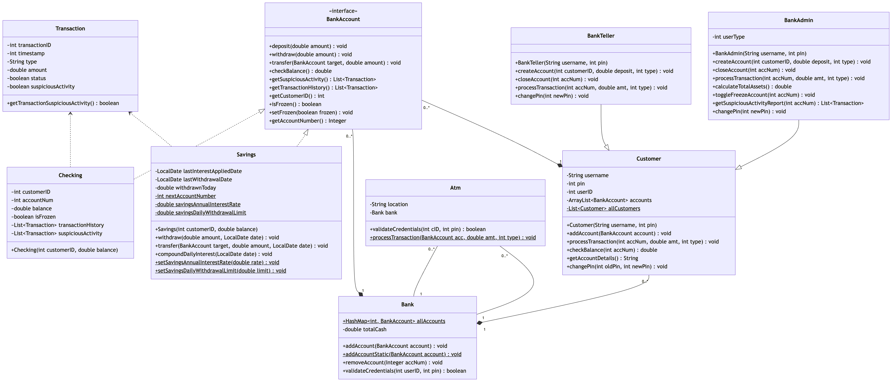
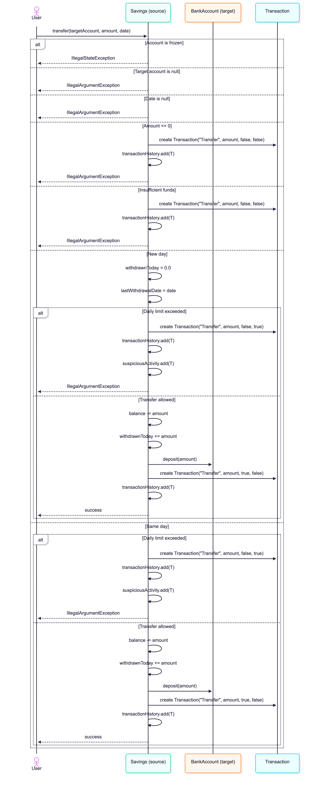
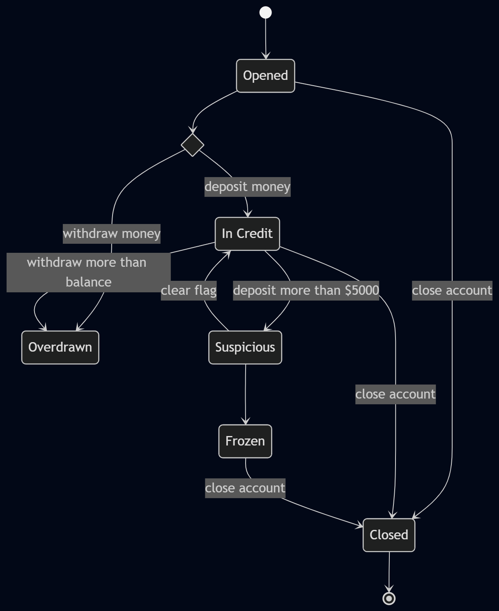
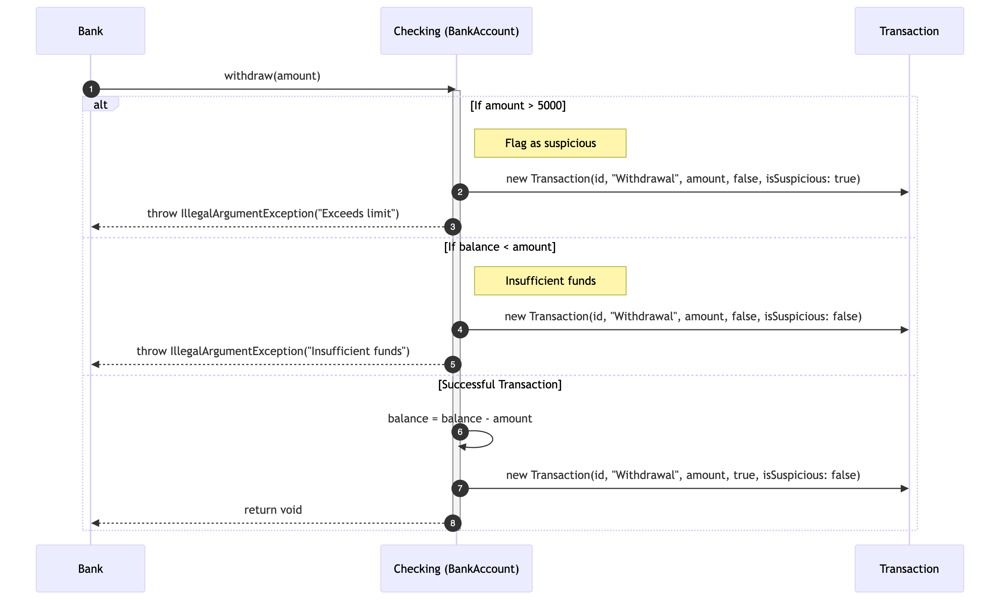
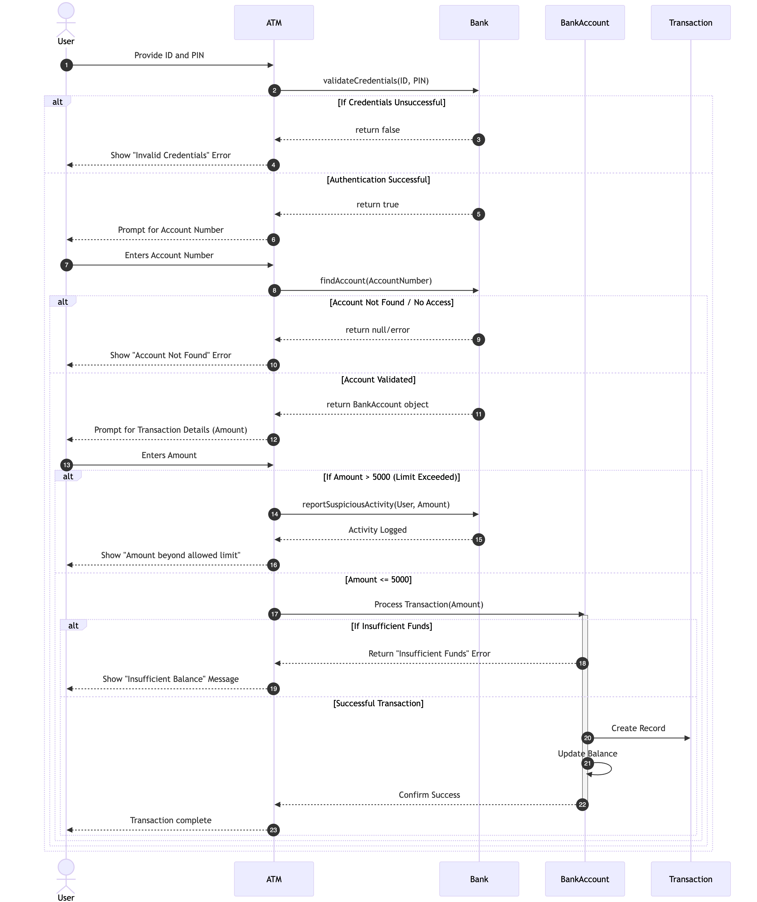

User Testing Script
https://drive.google.com/file/d/1YNqXggosnaRsfqz3wNCxuejEjbiQx5iA/view?usp=sharing

Work Breakdown 

Who is doing what: (Testing + Implementation)  
Dena - ATM and Customer classes, readme.md, Customer Sequence diagram, State Diagram  
Baneet - BankTeller and BankAdmin Classes, Use Case Diagram  
Faith - BankAccount, Transactions, Checking, Cli classes, Class Diagram, User Testing Script  
Ahmad - Bank and Savings classes, fixed tests, Savings Sequence Diagram  

Class Diagram by Faith
  

Use Case Diagram by Baneet
 

Use Cases:
1. Customer creates a checking account through the BankTeller, and then deposits money.
2. Customer withdraws a large amount of money to an existing savings account, BankAdmin looks at a list of transactions, deems it suspicious and freezes account
3. Customer transfers money to different account. 

Customer and ATM Sequence Diagram by Dena
 

Savings Sequence Diagram by Ahmad
 

State Diagram for Bank Account by Dena
 

Faith Sequence Diagrams

