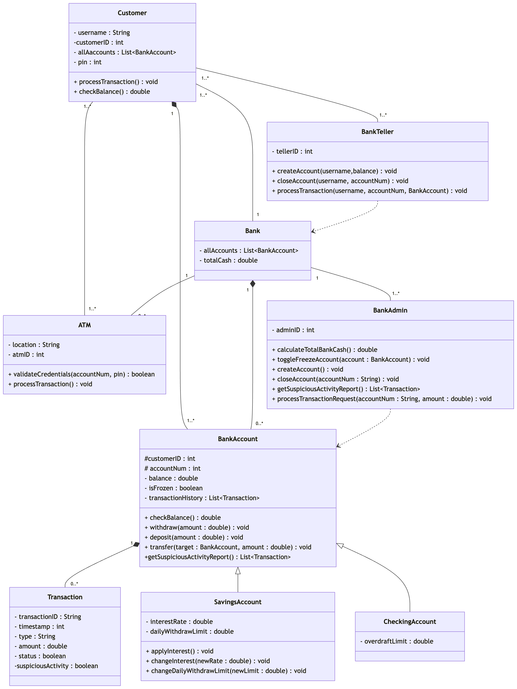
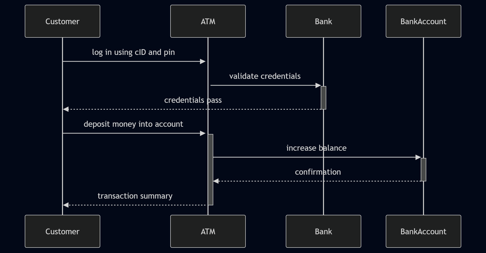

Who is doing what: (Testing + Implementation)  
Dena - ATM and Customer classes, readme.md, Sequence diagrams  
Baneet - BankTeller and BankAdmin Classes, Use Case Diagram  
Faith - BankAccount, Transactions, Checking, Cli classes, Class Diagram  
Ahmad - Bank and Savings classes, fixed tests  

Class Diagram by Faith
  

Use Case Diagram by Baneet
 

Customer validateCredentials and processTransaction Sequence Diagram

Use Cases:
1. Customer creates a checking account through the BankTeller, and then deposits money.
2. Customer withdraws a large amount of money to an existing savings account, BankAdmin looks at a list of transactions, deems it suspicious and freezes account
3. Customer transfers money to different account.